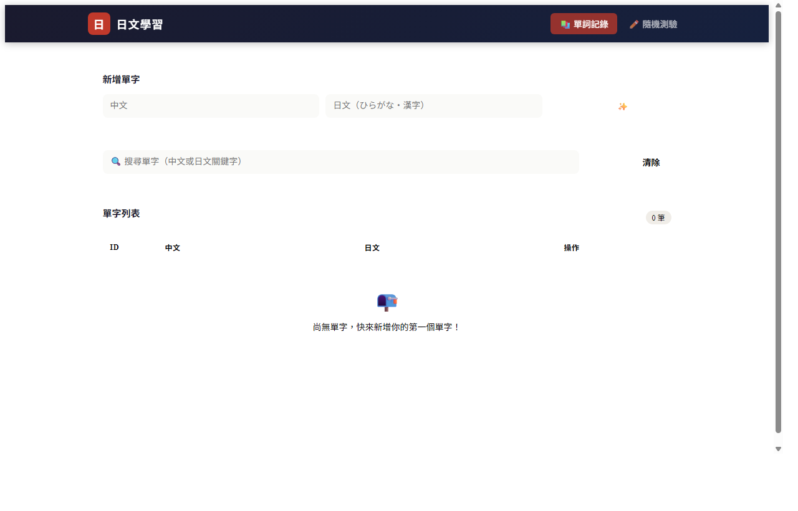
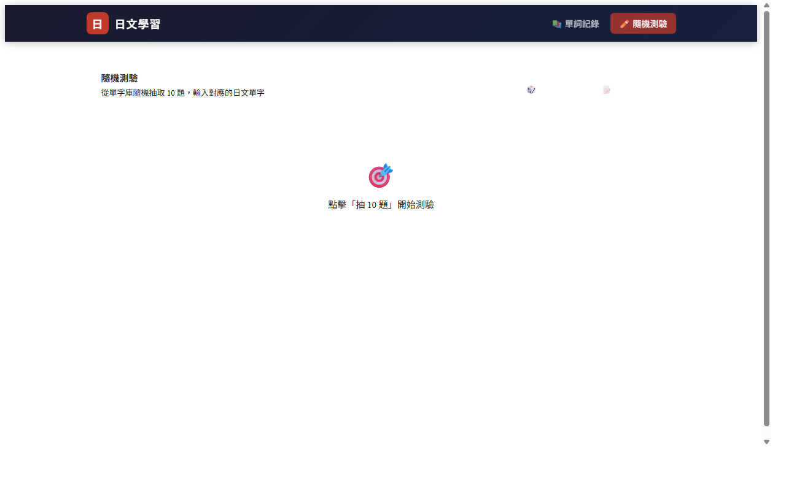

# 🇯🇵 Japanese Vocabulary Practice

> 一個結合 **AI 助理** 與 **RAG 技術**的日文單字學習 Web 應用，幫助你更有效率地記憶、練習日文單字。


---

## 📸 畫面預覽

### 單詞記錄頁


### 隨機測驗頁


---

## ✨ 功能介紹

### 📚 單字管理
- **新增單字**：輸入中文與對應日文，儲存至資料庫
- **搜尋單字**：透過中文或日文關鍵字即時搜尋
- **編輯 / 刪除**：行內直接編輯，操作直覺

### ✏️ 隨機測驗
- 從單字庫隨機抽取 10 題
- 顯示中文，由使用者輸入對應的日文
- 送出後顯示得分與逐題比對結果（正確綠底 / 錯誤紅底）

### 🤖 AI 助理（Qwen2.5-7B + RAG）
- 點擊「✨ AI 建議」，AI 根據輸入的單字：
  - 產生包含該單字的自然日文例句
  - 提供例句的繁體中文翻譯
  - 檢查日文輸入是否正確對應中文
- **RAG 技術**：AI 優先在例句中融入你已學過的相關單字，達到交叉複習效果

---

## 🛠 技術架構

| 層級 | 技術 |
|------|------|
| 前端 | Vue 3 + TypeScript + Vue Router + Vite |
| 後端 | Python FastAPI + SQLAlchemy |
| 資料庫 | MySQL 8 |
| AI 模型 | Hugging Face Inference API（Qwen2.5-7B-Instruct） |
| RAG | ChromaDB + sentence-transformers（paraphrase-multilingual-MiniLM-L12-v2） |

### 專案結構

```
japanness_project/
├── backend/
│   ├── main.py          # FastAPI 主程式（API 路由 + AI 端點 + 靜態服務）
│   ├── rag.py           # RAG 模組（ChromaDB 向量索引管理）
│   ├── db.py            # 資料庫連線設定
│   ├── models.py        # SQLAlchemy 資料模型
│   ├── schemas.py       # Pydantic 請求 / 回應 schema
│   ├── requirements.txt # Python 套件清單
│   └── .env             # 環境變數（不納入版控）
├── jp-front/
│   ├── src/
│   │   ├── views/
│   │   │   ├── AddVocab.vue  # 主頁：單字管理 + AI 助理
│   │   │   └── Quiz.vue      # 隨機測驗頁
│   │   ├── App.vue           # 應用殼層 + 導覽列
│   │   ├── router.ts         # 前端路由設定
│   │   └── main.ts
│   └── package.json
├── docs/                # 文件與截圖
├── start.bat            # 一鍵啟動伺服器並開啟瀏覽器
├── build.bat            # 建置前端靜態檔案
└── .gitignore
```

---

## ⚙️ 環境需求

- Python 3.10+
- Node.js 18+
- MySQL 8.0+
- [Hugging Face API Key](https://huggingface.co/settings/tokens)（免費申請）

---

## 🚀 安裝與設定

### 1. 安裝後端套件

```bash
cd backend
pip install -r requirements.txt
```

### 2. 安裝前端套件

```bash
cd jp-front
npm install
```

### 3. 設定環境變數

在 `backend/` 目錄下建立 `.env` 檔案：

```env
MYSQL_HOST=127.0.0.1
MYSQL_PORT=3306
MYSQL_USER=root
MYSQL_PASSWORD=你的MySQL密碼
MYSQL_DB=japanese
HF_API_KEY=你的HuggingFace_API_Key
```

### 4. 建立 MySQL 資料庫

```sql
CREATE DATABASE japanese CHARACTER SET utf8mb4 COLLATE utf8mb4_unicode_ci;
```

> 資料表會在首次啟動時由 SQLAlchemy 自動建立。

---

## ▶️ 啟動方式

### 方法一：雙擊 start.bat（推薦）

直接雙擊 `start.bat`，程式會自動：
1. 啟動 FastAPI 後端伺服器
2. 等待伺服器就緒後開啟瀏覽器

> 可在 `start.bat` 上右鍵 → 傳送到 → 桌面（建立捷徑），方便日後一鍵開啟。

### 方法二：手動啟動

```bash
# 建置前端
cd jp-front && npm run build

# 啟動後端（同時服務前端靜態檔案）
cd backend && uvicorn main:app --port 8000
```

前往 http://127.0.0.1:8000 開始使用。

---

## 📡 API 端點

| 方法 | 路徑 | 說明 |
|------|------|------|
| `POST` | `/vocab` | 新增單字 |
| `GET` | `/vocab` | 取得單字列表（支援 `?keyword=` 搜尋） |
| `PUT` | `/vocab/{id}` | 更新單字 |
| `DELETE` | `/vocab/{id}` | 刪除單字 |
| `GET` | `/quiz/random10` | 隨機取得 10 題測驗 |
| `POST` | `/quiz/submit` | 提交測驗答案並取得結果 |
| `POST` | `/ai/suggest` | AI 產生例句、翻譯、拼寫檢查（含 RAG） |
